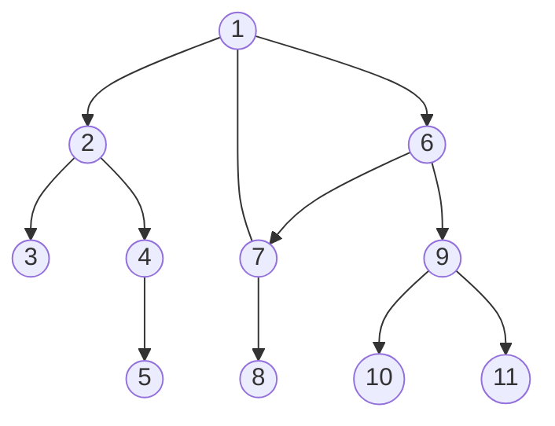
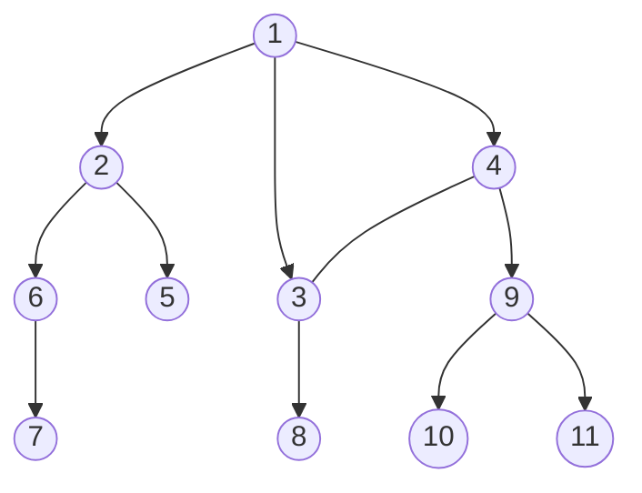

## Introduction
DFS and BFS are both algorithms used for searching graphs, i.e. graph traversal.
There are other algorithms such as backtracking, but these two are the most useful ones.

Before going on, we should know some common notions in graph theory.
* $\vert{V}\vert$: the number of vertices
* $\vert{E}\vert$: the number of edges

## DFS
**Depth-First-Search(DFS)**  is an algorithm for traversing or searching tree or graph data structures.
The algorithm starts at the root node (selecting some arbitrary node as the root node in the case of a graph) 
and explores as far as possible along each branch before backtracking.

### Explanation


The graph above is an example result for the DFS algorithm.

The time and space analysis of DFS differs according to its application area.
DFS is typically used to traverse an entire graph, and takes time $ O(|V|+|E|) $
if implemented by using an adjacency list. This is linear in the size of the graph.
In these applications, it also uses space $ O(|V|) $ in the worst case to store the stack of vertices 
on the current search path as well as the set of already-visited vertices.

* **Time complexity**: $ O(\vert{V}\vert+\vert{E}\vert) $
* **Space complexity**: $ O(\vert{V}\vert) $

### Code
Let's see the sample code.
```cpp
// Adjacency list ✨
vector<int> G[V];
bool visited[V];

void dfs(int now){
  visited[now] = true;
  for(int next:G[now]) if(!visited[next])
    dfs(next);
}


// Adjacency matrix: O(|V|²)
vector<vector<int>> G;
bool visited[V];

void dfs(int now){
  visited[now] = true;
  for(int next:G[now]) if(G[now][next] and !visited[next])
    dfs(next);
}
```

### Applications
* Vertex orderings (preordering, postordering, etc.)
* Finding connected components / strongly connected components
* Topological sorting
* Planarity testing


## BFS
**Breadth-first search(BFS)** is another algorithm for graph searching.
It starts at the root and explores all nodes at the present depth prior 
to moving on to the nodes at the next depth level.
Extra memory, usually a queue, is needed to track the child nodes encountered but not yet explored.

### Explanation


The graph above is an example result for the DFS algorithm.

The time complexity can be expressed as $ O(|V|+|E|) $ if implemented by using adjacency list,
since every vertex and every edge will be explored in the worst case.
When additional data structures are used to determine which vertices have already been added to the queue,
the space complexity can be expressed as $ O(|V|) $. This is in addition to the space required for the graph itself.

* **Time complexity**: $ O(\vert{V}\vert+\vert{E}\vert) $
* **Space complexity**: $ O(\vert{V}\vert) $

### Code
```cpp
// Adjacency list ✨
vector<int> G[V];
queue<int> Q;
bool visited[V];

void bfs(int root){
  Q.push(root);
  visited[root] = true;
  
  while(!Q.empty()){
    int now = Q.front();
    Q.pop();
    for(int next:G[now]) if(!visited[next]){
      Q.push(next);
      visited[next] = true;
    }
  }
}


// Adjacency matrix: O(|V|²)
vector<vector<int>> G[V];
queue<int> Q;
bool visited[V];

void bfs(int root){
  Q.push(root);
  visited[root] = true;
  
  while(!Q.empty()){
    int now = Q.front();
    Q.pop();
    for(int next:G[now]) if(G[now][next] and !visited[next]){
      Q.push(next);
      visited[next] = true;
    }
  }
}
```

### Applications
* Finding the shortest path between two nodes
* Finding the depth of a node
* Ford–Fulkerson method
* Testing the bipartite-ness of a graph


## Conclusion

It's necessary to master these two graph traversing algorithms to implement graph theory computations.
Maybe PS will help a lot. 😄
