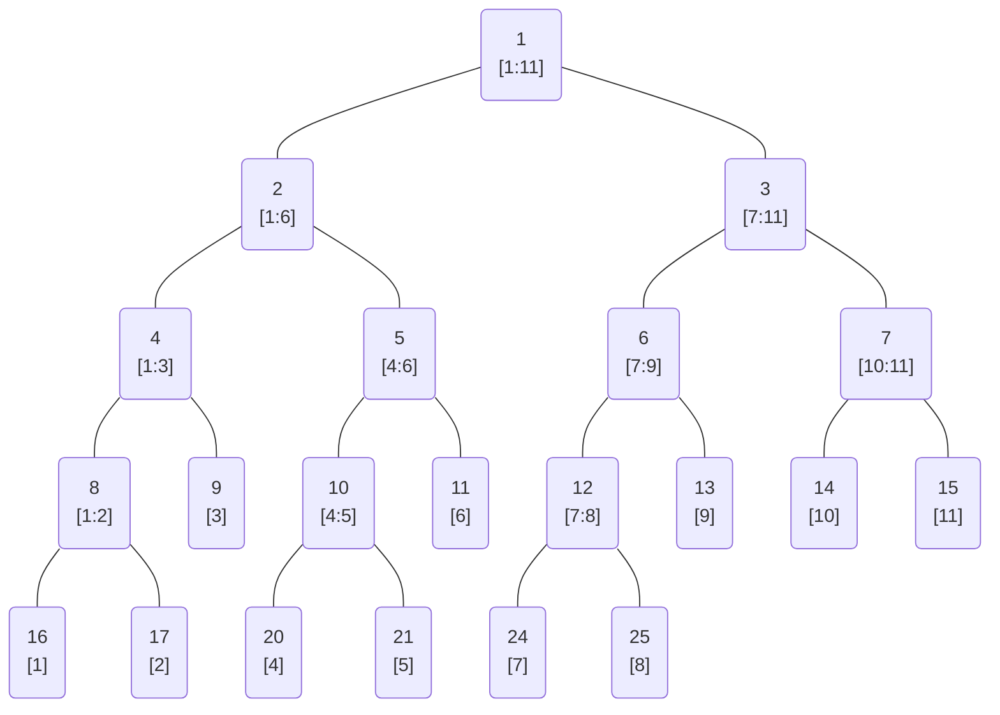
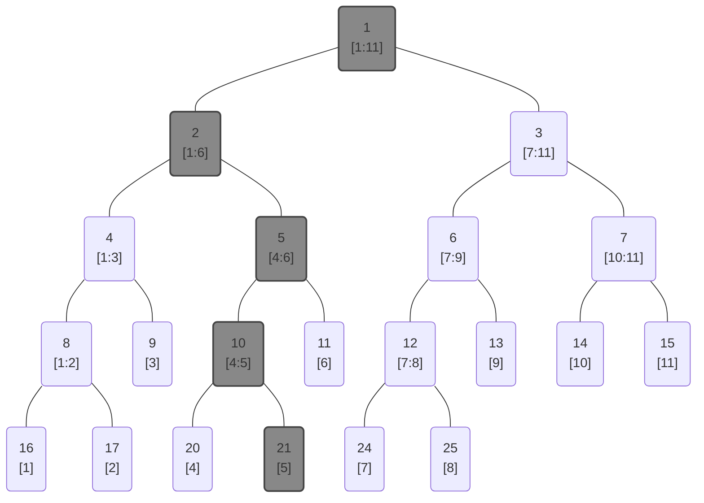
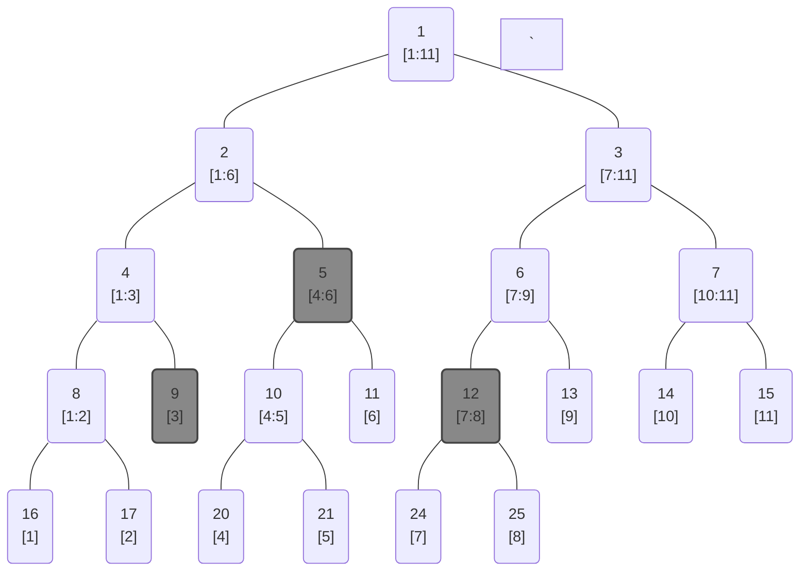

<!--more-->
* this unordered seed list will be replaced by the toc
{:toc}

## Introduction
A **segment tree** is a tree data structure for storing intervals, or segments. It allows to perform queries and updates on the intervals in very efficient manner.
There are many applications of segment trees: calculating the sum of all elements in a range, finding the minimum or maximum element in a range, etc.

## Segment Tree

### Explanation
Segment tree is a data structure for monoids $(M, \ast)$, where $M$ is a set with an identity element $e$ and an associative binary operation $\ast$.
(Read more about monoids [here](https://en.wikipedia.org/wiki/Monoid).)

Given an array $A=[a_1,\cdots,a_N]$ of size $N$, a segment tree is a binary tree where each node represents an interval $[l,r]$ of the array.
Each node stores the result of applying the operation $\ast$ to all elements in the interval it represents, i.e. $a_l \ast \cdots \ast a_r$.
The root node represents the entire array $[1:N]$, and each leaf node represents a single element of the array.
Every parent node has left and right children, which represent the left and right halves of the parent's interval.
You can see that the segment tree is a _full binary tree_.

Segment tree can carry out two types of queries in $O(\log N)$ time complexity:
1. **Range query**: Given a range $[l,r]$, find the result of applying the operation $\ast$ to all elements in the range. In other words, calculate $a_l \ast a_{l+1} \ast \cdots \ast a_r$.
2. **Point update**: Given an index $i$ and a new value $v$, update the element $a_i$ to $v$.



The binary tree above is an example of a segment tree for the array with 11 elements.
Each node is written in the form of node index and the interval it represents.
When we update the 5th element of the array, the segment tree will be updated as follows.



When we query the sum of the elements in the range $[3,8]$, following nodes will be visited.



### Code
Let's see the sample code.
```cpp
const int N;
const int TREE_SIZE = 1 << ((int)ceil(log2(N)) + 1);

data A[N];
Node tree[TREE_SIZE];

Node merge(Node a,Node b){ /* merge two nodes */ }
Node conv(data a){ /* convert data to node */ }
Node identity(){ /* return identity node */ }

Node init(int nd,int l,int r){
    if(l==r) return tree[nd] = conv(A[l]);
    int m = (l+r)/2;
    return tree[nd] = merge(init(nd*2,l,m),init(nd*2+1,m+1,r));
}

Node update(int nd,int l,int r,int idx,data val){
    if(idx<l or r<idx) return tree[nd];
    if(l==r) return tree[nd] = conv(val);
    int m = (l+r)/2;
    return tree[nd] = merge(update(nd*2,l,m,idx,val),update(nd*2+1,m+1,r,idx,val));
}

Node Query(int nd,int l,int r,int s,int e){
    if(e<l or r<s) return identity();
    if(s<=l and r<=e) return tree[nd];
    int m = (l+r)/2;
    return merge(Query(nd*2,l,m,s,e),Query(nd*2+1,m+1,r,s,e));
}
```

So here, the data type **Node** should be the monoid structure $(M, \ast)$.
Commonly, we store data in the array $A$ in another data type(**data**, such as integer etc.), because it's easy and intuitive.
If such data type is different with the node, you should convert the data to the node structure in the function **conv**.

### Applications

* Range sum query
* Range minimum/maximum query
* Range gcd/lcm query