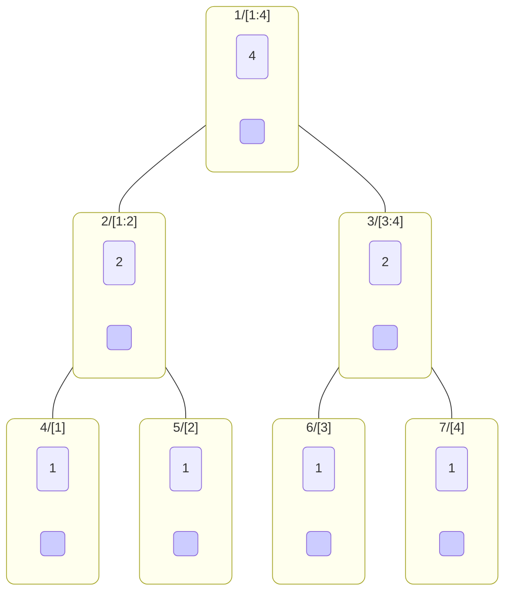
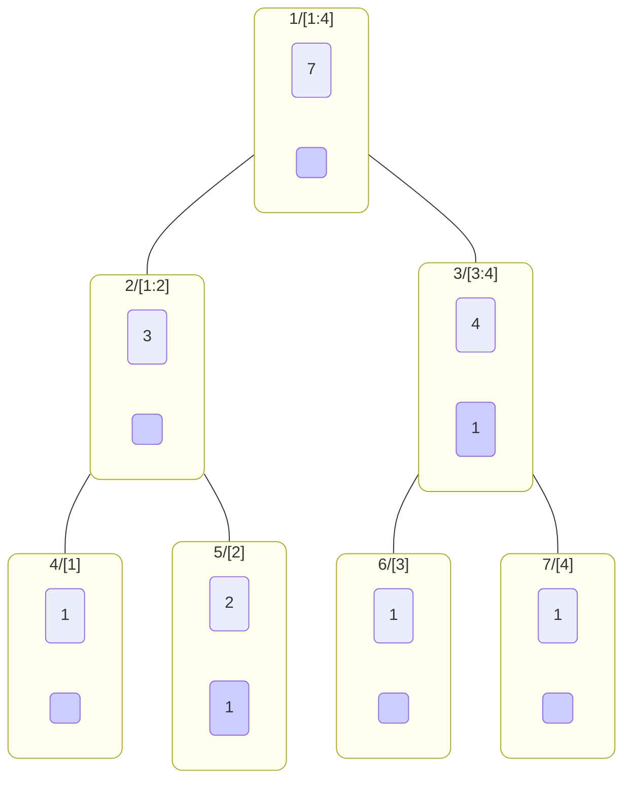
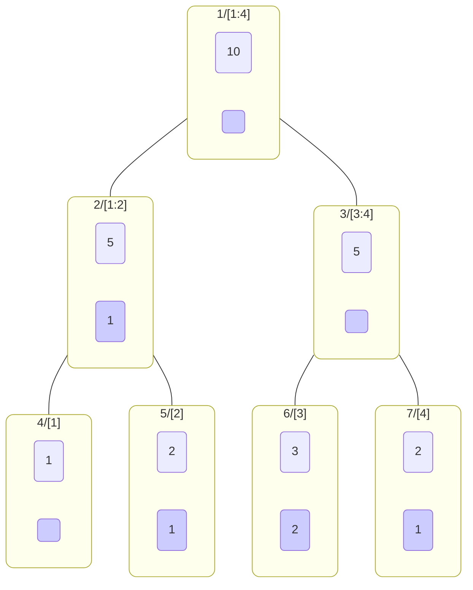
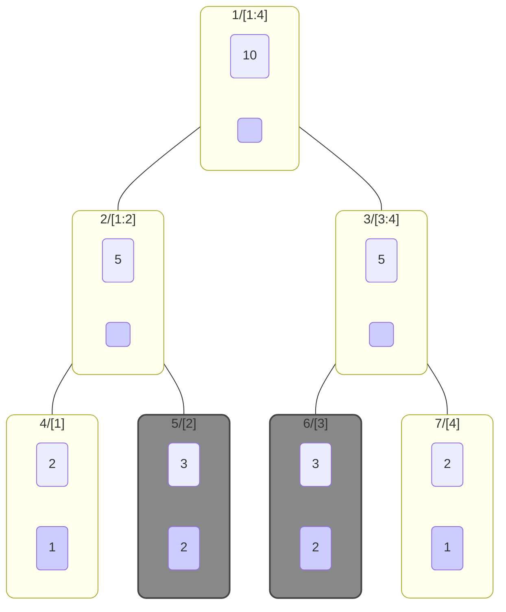

<!--more-->
* this unordered seed list will be replaced by the toc
{:toc}

## Introduction
**Lazy propagation** is a technique used to delay the updates in segment trees. It is used to optimize the time complexity of range updates in segment trees.

## Lazy Propagation

### Explanation
Segment tree with lazy propagation is a data structure for the pair of a monoid $(M, \ast)$ and a set of functions
$F \subset M^M$ which satisfies the following property:
- $\forall f\in F, \; \forall a,b\in M, \; f(a\ast b) = f(a)\ast f(b)$

i.e. $f$ is an endomorphism of the monoid $(M, \ast)$.
- $F = \mathrm{End}(M)$

An endomorphism is a homomorphism from a set to itself, and a homomorphism is a function that preserves the structure of the set. (Read more about homomorphisms [here](https://en.wikipedia.org/wiki/Homomorphism).)

Consider an array $A=[a_1,\cdots,a_N]$ of size $N$.
Segment tree with lazy propagation can carry out two types of queries in $O(\log N)$ time complexity:
1. **Range query**: Given a range $[l,r]$, find the result of applying the operation $\ast$ to all elements in the range. In other words, calculate $a_l \ast a_{l+1} \ast \cdots \ast a_r$.
2. **Range update**: Given a range $[l,r]$ and a function $f\in F$, update all elements in the range by applying the function $f$ to them:
    $[\cdots,a_l,\cdots,a_r,\cdots] \to [\cdots, f(a_l), \cdots, f(a_r),\cdots]$

The idea is to store the updates in the nodes of the segment tree and apply them only when needed.
Such new tree nodes are called **lazy nodes** and the updates are called **lazy updates**.



The binary tree above is an example of a segment tree with lazy propagation for the array $[1,1,1,1]$.
In each subgraph, the left node represents the sum of all elements in the range, and the right node represents the lazy update.

When we update the range $[2:4]$ by adding $1$ to all elements, the segment tree will be updated as follows.



When we update the range $[1:3]$ by adding $1$ to all elements, the segment tree will be updated as follows.



When we query the sum of the elements in the range $[3,4]$, the segment tree will be updated
and the nodes will be visited as follows.



### Code
Let's see the sample code.
```cpp
const int N;
const int TREE_SIZE = 1 << ((int)ceil(log2(N)) + 1);

data A[N];
Node tree[TREE_SIZE];
Node_lazy lazy[TREE_SIZE];

Node merge(Node a,Node b){ /* merge two nodes */ }
Node conv(data a){ /* convert data to node */ }
Node identity(){ /* return identity node */ }
Node_lazy merge_lazy(Node_lazy a,Node_lazy b){ /* merge two lazy nodes */ }
Node_lazy identity_lazy(){ /* return identity lazy node */ }
Node apply_lazy(Node nd,Node_lazy lz){ /* apply lazy node to the node */ }

Node init(int nd,int l,int r){
    if(l==r) return tree[nd] = conv(A[l]);
    int m = (l+r)/2;
    return tree[nd] = merge(init(nd*2,l,m),init(nd*2+1,m+1,r));
}

void propagate(int nd,int l,int r){
    if(lazy[nd]==identity_lazy()) return;
    lazy[nd*2] = merge_lazy(lazy[nd*2],lazy[nd]), lazy[nd*2+1] = merge_lazy(lazy[nd*2+1],lazy[nd]);
    tree[nd*2] = apply_lazy(tree[nd*2],lazy[nd]), tree[nd*2+1] = apply_lazy(tree[nd*2+1],lazy[nd]);
    lazy[nd] = identity_lazy();
}

Node update(int nd,int l,int r,int s,int e,Node_lazy lz){
    if(e<l or r<s) return tree[nd];
    if(s<=l and r<=e){
        lazy[nd] = merge_lazy(lazy[nd],lz);
        return tree[nd] = apply_lazy(tree[nd],lz);
    }
    propagate(nd,l,r);
    int m = (l+r)/2;
    return tree[nd] = merge(update(nd*2,l,m,s,e,lz),update(nd*2+1,m+1,r,s,e,lz));
}

Node Query(int nd,int l,int r,int s,int e){
    if(e<l or r<s) return identity();
    if(s<=l and r<=e) return tree[nd];
    propagate(nd,l,r);
    int m = (l+r)/2;
    return merge(Query(nd*2,l,m,s,e),Query(nd*2+1,m+1,r,s,e));
}
```

### Example

Let's think of an example of calculating the sum of elements in a range and updating the elements in a range by adding a constant value.
Then, the code will be as follows:

```cpp
struct Node{
    int sum,len;
    Node(int sum=0,int len=0):sum(sum),len(len){}
};

Node merge(Node a,Node b){
    return Node(a.sum+b.sum,a.len+b.len);
}
Node conv(int a){
    return Node(a,1);
}
Node identity(){
    return Node(0,0);
}
int merge_lazy(int a,int b){
    return a+b;
}
int identity_lazy(){
    return 0;
}
Node apply_lazy(Node nd,int lz){
    return Node(nd.sum+nd.len*lz,nd.len);
}
```